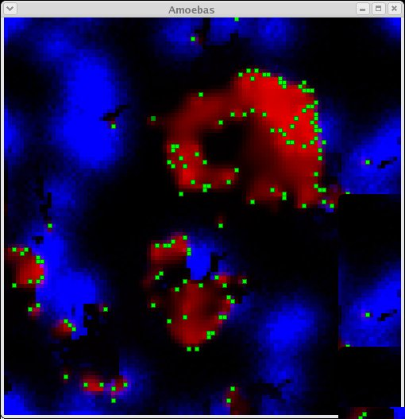

#Simulation Model to Aid Understanding into Self-organised Collective Behaviour
##Project for Cognitive Science BSc 2004/2005

C++ with OpenGL

###Abstract:

This report focuses on the conditions under which a population of agents initially able to survive
independently will produce progressively more integrated behaviour, such that they become interdependent on one another, through the process of self-organisation. A simulation model was produced
in order to understand these conditions. Many existing models focus on accurately modelling selforganised collective behaviour but not its emergence from independent behaviour. It was found that the
transition was most clear when agents could benefit from each other’s presence without having to make
radical behavioural changes, and when their life-span was so short relative to their movement speed that
their position within an aggregate effected the evolution of their behavioural strategy, causing spatial
organisation of different strategies within aggregates.

###Complete report and explanation is **project.pdf**
